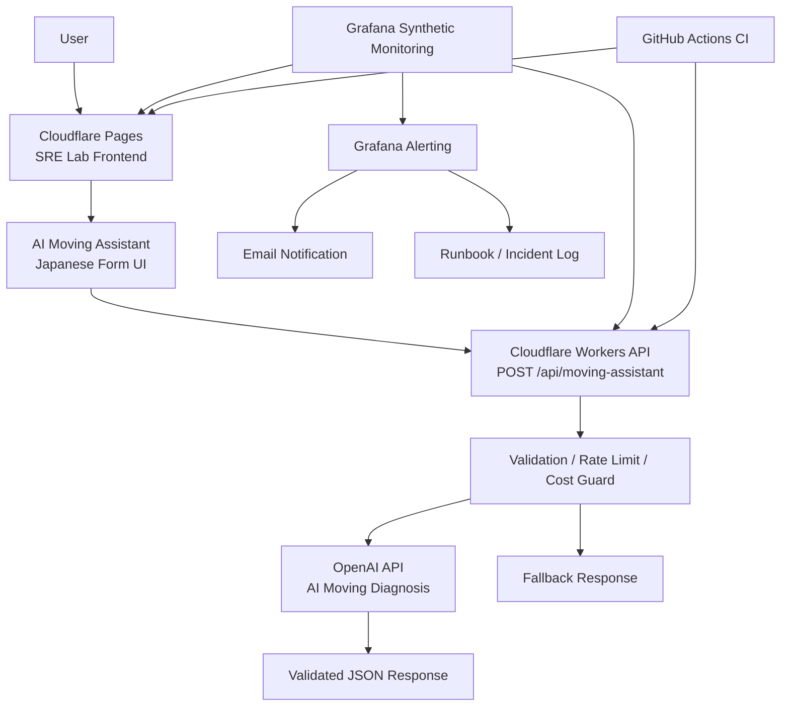

# SRE Lab

SRE Lab is a portfolio project for building, operating, monitoring, and improving a small AI-powered web service.

This project demonstrates practical SRE and platform engineering workflows through a real deployed service, including frontend/API separation, CI/CD, synthetic monitoring, alerting, runbooks, incident records, and operational documentation.

## Live Demo

- Frontend: https://sre-lab.pages.dev/
- Workers API: https://sre-lab-api.daisan-tanaka.workers.dev
- API endpoint: POST /api/moving-assistant

## Project Goal

The goal of this project is to demonstrate the ability to operate a small production-like service, not just build an application.

This project focuses on:

- Frontend/API separation
- CI/CD with GitHub Actions
- Cloudflare Workers deployment automation
- Synthetic monitoring
- Alerting
- Runbooks
- Incident records
- Operations documentation
- Cost-aware AI service design

## Current Service

### AI Moving Assistant

AI Moving Assistant is a Japanese moving preparation assistant.

Current behavior:

- Collects moving-related user inputs
- Validates request method, path, Content-Type, JSON body, body size, and total input length
- Calls a Cloudflare Workers API
- Generates moving preparation advice through OpenAI API
- Returns a safe fallback response if the AI API fails
- Displays packing materials, checklist items, risk notes, disclaimers, and AI status
- Tracks AI usage and estimated cost in Cloudflare KV
- Enforces rate limiting, AI-specific daily limits, and estimated cost limits

Reliability behavior:

- API key is stored only as a Cloudflare Workers Secret
- AI API is never called directly from frontend JavaScript
- Timeout and fallback behavior are implemented
- AI response shape is validated before returning to the frontend
- Cost limit behavior returns 503 / cost_limit_reached
- AI daily limit behavior returns 429 / ai_limit_reached

## Architecture

- Detailed architecture: docs/architecture.md

## Tech Stack

| Area | Technology |
|---|---|
| Frontend | HTML, CSS, JavaScript |
| Hosting | Cloudflare Pages |
| API | Cloudflare Workers |
| CI/CD | GitHub Actions, Wrangler |
| Monitoring | Grafana Cloud Synthetic Monitoring |
| Alerting | Grafana Alerting |
| Documentation | Markdown |
| Repository | GitHub |

## SRE / Operations Features

This project includes the following SRE-oriented components:

- Public frontend deployment
- Public Workers API deployment
- Frontend/API separation
- API input validation
- GitHub Actions CI
- Workers auto deployment
- Synthetic monitoring for frontend
- Synthetic monitoring for API
- Alert rules for frontend and API availability
- Email notification contact point
- Runbook
- Incident log
- Operations guide
- Architecture documentation
- Cost-control design and implementation for paid AI APIs
- OpenAI API integration through Cloudflare Workers
- Timeout and fallback behavior
- AI response validation
- AI usage and estimated cost tracking
- AI-specific daily limits
- Cost limit behavior verification

## API Safety

The Workers API includes basic safety controls before introducing a real AI API.

Implemented controls:

- Standardized JSON error response
- Method validation
- Path validation
- JSON parse error handling
- Content-Type validation
- Request size limit
- Total input length limit
- Existing mock response behavior preserved

Verified responses:

- Valid POST: 200
- Empty JSON body: 400 / missing_input
- Invalid JSON: 400 / invalid_json
- Unsupported method: 405 / method_not_allowed
- Unknown path: 404 / not_found
- Missing JSON Content-Type: 415 / unsupported_media_type
- Input too large: 413 / input_too_large

## Real AI API Integration

The Workers API now calls OpenAI API from the backend.

Implemented controls:

- OPENAI_API_KEY is stored as a Cloudflare Workers Secret
- AI_MODEL is configured as a Worker environment variable
- Frontend never receives or stores the AI API key
- OpenAI API call is executed only after request validation, rate limiting, and cost checks
- AI API timeout is enforced
- Fallback response is returned when OpenAI API fails
- AI-generated response is validated before returning to the user
- AI usage counters are recorded in Cloudflare KV
- Estimated input tokens, output tokens, and JPY cost are recorded in Cloudflare KV

Verified behavior:

- OpenAI API failure: 200 with fallback JSON response
- OpenAI API success: 200 with aiStatus: generated
- AI per-IP daily limit: 429 / ai_limit_reached
- Estimated monthly cost stop threshold: 503 / cost_limit_reached

## Usage / Cost Monitoring

Usage and cost monitoring has been introduced for the AI Moving Assistant service.

Current monitoring approach:

- Cloudflare KV is used as the primary operational source for immediate usage and estimated cost checks
- OpenAI Platform Usage is used as a secondary reconciliation source
- Manual usage and cost snapshots are recorded in docs/usage-cost-report.md
- Future dashboard design is documented in docs/dashboard-design.md

Tracked metrics:

- API requests
- API success count
- API error count
- rate_limited count
- AI calls
- AI success count
- AI error count
- ai_limited count
- estimated input tokens
- estimated output tokens
- estimated daily cost
- estimated monthly cost

Current cost policy:

- OpenAI initial credit: 5 USD
- Auto recharge: off
- Monthly AI budget: 500 JPY
- Monthly warning threshold: 300 JPY
- Monthly stop threshold: 500 JPY
- Daily hard limit: 100 JPY

Verified behavior:

- Initial usage and cost snapshot recorded
- KV estimated usage is treated as the primary operational source
- OpenAI Usage mismatch handling policy documented
- Future usage/cost dashboard design documented

## CI/CD

### CI

The CI workflow validates the repository on push and pull request.

- Workflow: .github/workflows/ci.yml
- Checks:
  - Required files exist
  - API dependencies install successfully
  - API syntax check passes

### Worker Auto Deployment

The Cloudflare Workers API is deployed through GitHub Actions.

- Workflow: .github/workflows/deploy-worker.yml
- Trigger:
  - Push to main when files under apps/api change
  - Manual workflow dispatch
- Deployment target: sre-lab-api
- Required GitHub Secrets:
  - CLOUDFLARE_API_TOKEN
  - CLOUDFLARE_ACCOUNT_ID
- Verification:
  - Deploy Worker workflow succeeded
  - API syntax check passed
  - Wrangler deploy completed successfully

## Monitoring and Alerting

### Frontend Monitoring

- Target URL: https://sre-lab.pages.dev/
- Check type: HTTP uptime check
- Probe location: Tokyo, JP
- Expected status code: 200
- Frequency: 60s

### API Monitoring

- Target URL: https://sre-lab-api.daisan-tanaka.workers.dev/api/moving-assistant
- Check type: HTTP API endpoint check
- Method: POST
- Probe location: Tokyo, JP
- Expected status code: 2xx
- Frequency: 60s

### Alert Rules

- sre-lab-uptime-down
- sre-lab-api-down

Alert behavior:

- Metric: probe_success
- Condition: probe_success < 0.5
- Evaluation interval: 1m
- Pending period: 2m
- Contact point: sre-lab-email
- Runbook: docs/runbook.md

## Documentation

| Document | Purpose |
|---|---|
| docs/architecture.md | Detailed architecture and reliability flow |
| docs/runbook.md | Incident response procedures |
| docs/incidents.md | Incident and operational records |
| docs/operations.md | Daily/weekly operations and deployment checks |
| docs/services.md | Service planning |
| docs/moving-assistant.md | AI Moving Assistant specification |
| docs/ai-api-design.md | Real AI API backend design and safety controls |
| docs/cost.md | AI usage and cost operations |\n| docs/usage-cost-report.md | Manual usage and cost snapshot records |
| docs/dashboard-design.md | Future usage and cost dashboard design |

## Operational Records

Current operational records include:

- Initial production readiness check
- Worker auto deployment verification
- Workers API safety hardening verification
- KV-based rate limiting verification
- Usage and cost tracking foundation verification
- OpenAI API Worker integration verification
- AI cost tracking and daily limit verification
- Cost operations documentation
- cost_limit_reached behavior verification

These records are stored in:

- docs/incidents.md

## Current Scope

Implemented:

- Static frontend
- Cloudflare Workers API
- Frontend to API connection
- Real OpenAI API integration through Workers
- Cloudflare Workers Secret for OpenAI API key
- Request validation and standardized errors
- KV-based rate limiting
- AI-specific daily limits
- Estimated AI usage and cost tracking
- Usage and cost snapshot reporting
- Usage source-of-truth policy
- Future usage/cost dashboard design
- Cost limit behavior
- Timeout and fallback handling
- AI response validation
- CI
- Workers auto deployment
- Synthetic monitoring
- Alerting
- Runbook
- Incident log
- Operations guide
- Cost operations guide
- Architecture documentation
- GitHub Actions status badges

Not yet implemented:

- Implemented usage/cost dashboard
- Custom domain
- Deployment status dashboard
- Revenue experiments
- Second service

## Roadmap

1. Add second service such as AWS Cost Simulator
2. Add generated usage/cost reports or lightweight dashboard
3. Consider D1 for historical usage and cost reporting
4. Add usage and latency monitoring improvements
5. Add custom domain
6. Add revenue experiments

## Cost Operations

AI API usage and estimated cost operations are documented in:

- docs/cost.md

The current policy keeps OpenAI auto recharge disabled and uses Cloudflare KV to track estimated AI usage and cost.

