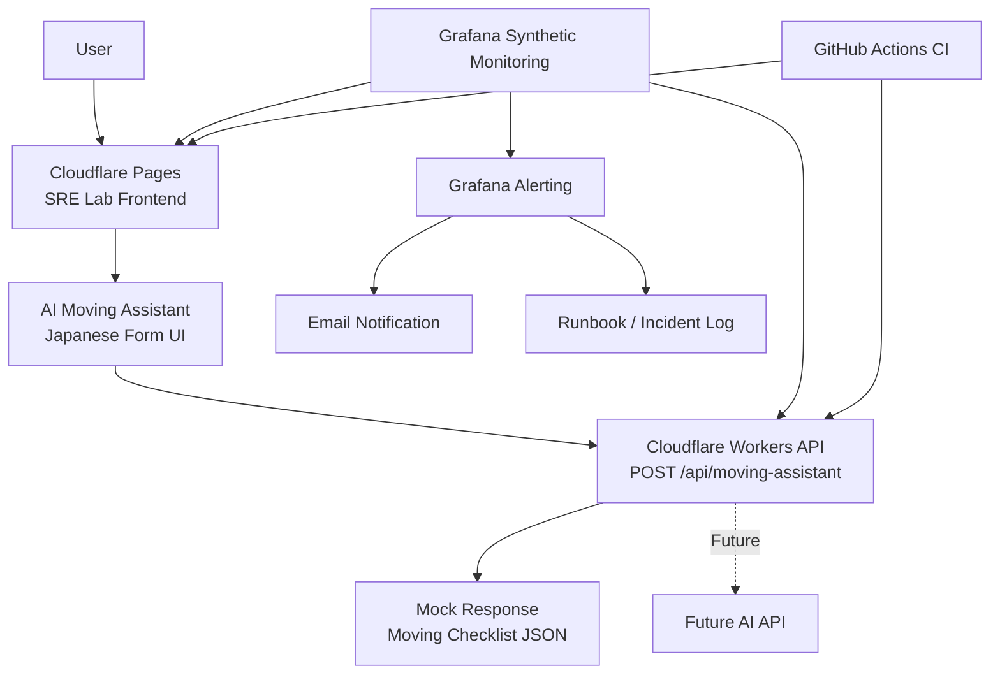

# SRE Lab

SRE Lab is a portfolio project for building, operating, monitoring, and improving a small AI-powered web service.

This project demonstrates practical SRE and platform engineering workflows through a real deployed service, including frontend/API separation, CI/CD, synthetic monitoring, alerting, runbooks, incident records, and operational documentation.

## Live Demo

- Frontend: https://sre-lab.pages.dev/
- Workers API: https://sre-lab-api.daisan-tanaka.workers.dev
- API endpoint: POST /api/moving-assistant

## Project Goal

The goal of this project is to demonstrate the ability to operate a small production-like service, not just build an application.

This project focuses on:

- Frontend/API separation
- CI/CD with GitHub Actions
- Cloudflare Workers deployment automation
- Synthetic monitoring
- Alerting
- Runbooks
- Incident records
- Operations documentation
- Cost-aware AI service design

## Current Service

### AI Moving Assistant

AI Moving Assistant is a Japanese moving preparation assistant.

Current behavior:

- Collects moving-related user inputs
- Validates empty input
- Calls a Cloudflare Workers API
- Returns a mock moving checklist response
- Displays packing materials, checklist items, risk notes, and disclaimers

Future behavior:

- Generate moving checklists through an AI API
- Add rate limiting
- Add cost controls
- Add timeout and fallback handling

## Architecture

- Detailed architecture: docs/architecture.md

## Tech Stack

| Area | Technology |
|---|---|
| Frontend | HTML, CSS, JavaScript |
| Hosting | Cloudflare Pages |
| API | Cloudflare Workers |
| CI/CD | GitHub Actions, Wrangler |
| Monitoring | Grafana Cloud Synthetic Monitoring |
| Alerting | Grafana Alerting |
| Documentation | Markdown |
| Repository | GitHub |

## SRE / Operations Features

This project includes the following SRE-oriented components:

- Public frontend deployment
- Public Workers API deployment
- Frontend/API separation
- API input validation
- GitHub Actions CI
- Workers auto deployment
- Synthetic monitoring for frontend
- Synthetic monitoring for API
- Alert rules for frontend and API availability
- Email notification contact point
- Runbook
- Incident log
- Operations guide
- Architecture documentation
- Cost-control design before introducing paid AI APIs

## API Safety

The Workers API includes basic safety controls before introducing a real AI API.

Implemented controls:

- Standardized JSON error response
- Method validation
- Path validation
- JSON parse error handling
- Content-Type validation
- Request size limit
- Total input length limit
- Existing mock response behavior preserved

Verified responses:

- Valid POST: 200
- Empty JSON body: 400 / missing_input
- Invalid JSON: 400 / invalid_json
- Unsupported method: 405 / method_not_allowed
- Unknown path: 404 / not_found
- Missing JSON Content-Type: 415 / unsupported_media_type
- Input too large: 413 / input_too_large

## CI/CD

### CI

The CI workflow validates the repository on push and pull request.

- Workflow: .github/workflows/ci.yml
- Checks:
  - Required files exist
  - API dependencies install successfully
  - API syntax check passes

### Worker Auto Deployment

The Cloudflare Workers API is deployed through GitHub Actions.

- Workflow: .github/workflows/deploy-worker.yml
- Trigger:
  - Push to main when files under apps/api change
  - Manual workflow dispatch
- Deployment target: sre-lab-api
- Required GitHub Secrets:
  - CLOUDFLARE_API_TOKEN
  - CLOUDFLARE_ACCOUNT_ID
- Verification:
  - Deploy Worker workflow succeeded
  - API syntax check passed
  - Wrangler deploy completed successfully

## Monitoring and Alerting

### Frontend Monitoring

- Target URL: https://sre-lab.pages.dev/
- Check type: HTTP uptime check
- Probe location: Tokyo, JP
- Expected status code: 200
- Frequency: 60s

### API Monitoring

- Target URL: https://sre-lab-api.daisan-tanaka.workers.dev/api/moving-assistant
- Check type: HTTP API endpoint check
- Method: POST
- Probe location: Tokyo, JP
- Expected status code: 2xx
- Frequency: 60s

### Alert Rules

- sre-lab-uptime-down
- sre-lab-api-down

Alert behavior:

- Metric: probe_success
- Condition: probe_success < 0.5
- Evaluation interval: 1m
- Pending period: 2m
- Contact point: sre-lab-email
- Runbook: docs/runbook.md

## Documentation

| Document | Purpose |
|---|---|
| docs/architecture.md | Detailed architecture and reliability flow |
| docs/runbook.md | Incident response procedures |
| docs/incidents.md | Incident and operational records |
| docs/operations.md | Daily/weekly operations and deployment checks |
| docs/services.md | Service planning |
| docs/moving-assistant.md | AI Moving Assistant specification |
| docs/ai-api-design.md | Future AI API backend design |

## Operational Records

Current operational records include:

- Initial production readiness check
- Worker auto deployment verification

These records are stored in:

- docs/incidents.md

## Current Scope

Implemented:

- Static frontend
- Cloudflare Workers mock API
- Frontend to API connection
- CI
- Workers auto deployment
- Synthetic monitoring
- Alerting
- Runbook
- Incident log
- Operations guide
- Architecture documentation
- GitHub Actions status badges

Not yet implemented:

- Real AI API integration
- Rate limiting
- API usage dashboard
- Custom domain
- Deployment status dashboard

## Roadmap

1. Add rate limiting to the Workers API
2. Add real AI API integration
3. Add API timeout and fallback handling
4. Add deployment status badge or dashboard
5. Add usage and latency monitoring
6. Add revenue experiments
