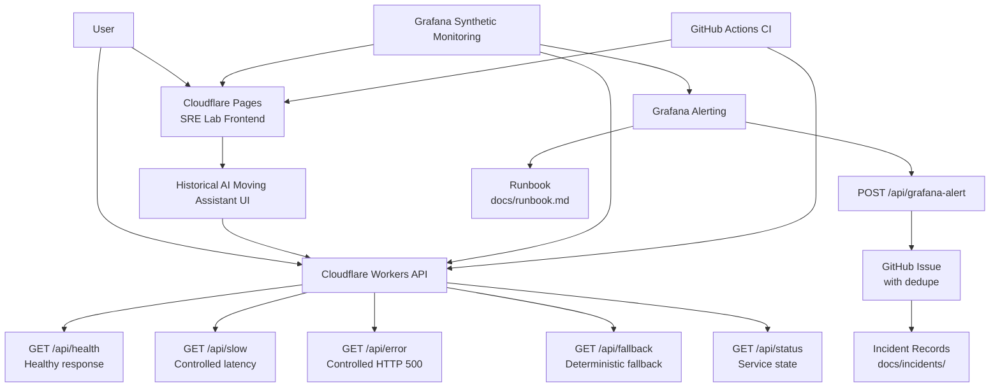
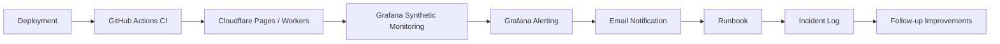

# Architecture

This document describes the current SRE Lab architecture.

## Current Status

```text
SRE portfolio-first
Reliability Demo API MVP implemented
```

SRE Lab preserves the historical Moving Assistant implementation while making Reliability Demo API the active portfolio target.

## Overview

SRE Lab is a small service platform for demonstrating production-oriented SRE and platform engineering practices.

The active target is Reliability Demo API, which exposes controlled healthy, slow, error, fallback, and status behaviors.

AI Moving Assistant remains a historical implementation asset. AWS Cost Simulator remains removed.

## Current Architecture



## Components

### Cloudflare Pages

Cloudflare Pages hosts the static frontend.

- URL: https://sre-lab.pages.dev/
- App path: apps/landing
- Main file: apps/landing/index.html
- Style file: apps/landing/styles.css

Active pages:

- apps/landing/index.html
- apps/landing/moving-assistant.html
- apps/landing/moving-checklist-sample.html

### AI Moving Assistant Frontend

The frontend provides a Japanese input form for moving preparation.

Current production behavior:

- Collects moving-related user inputs
- Validates empty input
- Calls the production Workers API
- Displays the API response
- Shows a clickable free sample CTA
- Links to the static free moving checklist sample page

### Cloudflare Workers API

Cloudflare Workers provides the backend API layer.

- API URL: https://sre-lab-api.daisan-tanaka.workers.dev
- Active demo endpoints: GET `/api/health`, `/api/slow`, `/api/error`, `/api/fallback`, `/api/status`
- Preserved endpoints: POST `/api/moving-assistant`, POST `/api/grafana-alert`
- App path: apps/api
- Main file: apps/api/src/index.js

Current behavior:

- Returns a healthy response for uptime monitoring
- Adds controlled latency with a safe 5000 ms maximum
- Generates a controlled standard-format HTTP 500 response
- Demonstrates deterministic fallback/degraded mode
- Reports active service state and endpoint inventory
- Validates JSON input
- Rejects empty requests
- Applies safety controls and rate limiting
- Returns fallback moving checklist response
- Creates or deduplicates GitHub Issues from Grafana alerts

Inactive / future behavior only if SRE Lab resumes:

- Call an AI API through the Worker
- Keep AI API keys out of frontend code
- Add stronger timeout handling
- Add stronger cost controls
- Add implementation-backed tracking only when needed

### Free Sample CTA

The free sample CTA is the current lightweight conversion point.

```text
AI Moving Assistant result page
↓
Free sample CTA click
↓
moving-checklist-sample.html visit
```

There is currently no payment flow, affiliate flow, email collection, or personal information collection.

### Grafana Synthetic Monitoring

Grafana monitors both the frontend and API.

Landing page check:

- Target: https://sre-lab.pages.dev/
- Type: HTTP uptime check
- Probe: Tokyo, JP
- Frequency: 60s

API check:

- Target: https://sre-lab-api.daisan-tanaka.workers.dev/api/moving-assistant
- Type: HTTP API endpoint check
- Method: POST
- Probe: Tokyo, JP
- Frequency: 60s

### Alerting

Grafana Alerting is configured for both frontend and API checks.

Alert rules:

- sre-lab-uptime-down
- sre-lab-api-down

Notification:

- Contact point: sre-lab-email

### Operations Documents

Operational documents:

- Runbook: docs/runbook.md
- Incident log: docs/incidents.md
- Operations guide: docs/operations.md
- AI API design: docs/ai-api-design.md

Management documents:

- YDTNK/engineering-career-hq/projects/sre-lab/revenue-cost-dashboard.md
- YDTNK/engineering-career-hq/projects/sre-lab/progress.md
- YDTNK/engineering-career-hq/projects/sre-lab/daily-log.md

## Reliability Flow



## Current Scope

Current production scope:

- Static frontend
- Reliability Demo API
- Workers fallback API
- Deterministic fallback response for AI Moving Assistant
- Frontend to API connection
- Free moving checklist sample page
- Synthetic monitoring
- Alerting
- Runbook
- Incident log
- GitHub Actions CI
- Workers auto-deploy
- Rate limiting
- API safety controls
- Docs-based Revenue / Cost Dashboard in management repository

Not currently active:

- Real AI API active usage
- Payment flow
- Affiliate flow
- Email collection
- Personal information collection
- Implementation-backed conversion tracking
- Custom domain

## Stop Policy

- Do not add new SRE Lab features for now
- Do not start Phase 17 until a real revenue route exists
- Move active learning focus to Kubernetes / CKA preparation
