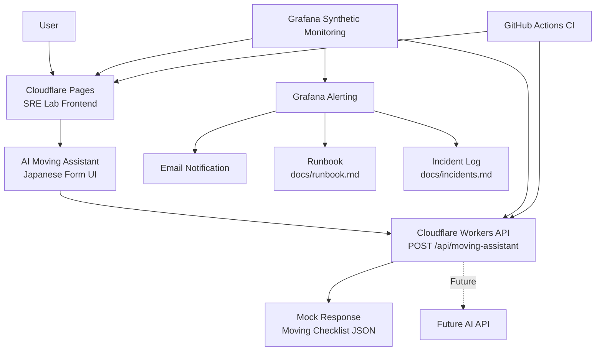
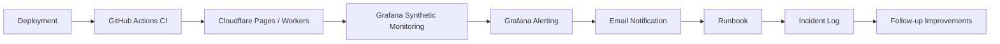

# Architecture

This document describes the current SRE Lab architecture.

## Overview

SRE Lab is a small service platform for building, operating, monitoring, and improving AI-powered micro services.

The current service is AI Moving Assistant, a Japanese moving preparation assistant.

## Current Architecture

## Components

### Cloudflare Pages

Cloudflare Pages hosts the static frontend.

- URL: https://sre-lab.pages.dev/
- App path: apps/landing
- Main file: apps/landing/index.html
- Style file: apps/landing/styles.css

### AI Moving Assistant Frontend

The frontend provides a Japanese input form for moving preparation.

Current behavior:

- Collects moving-related user inputs
- Validates empty input
- Calls the production Workers API
- Displays the API response

### Cloudflare Workers API

Cloudflare Workers provides the backend API layer.

- API URL: https://sre-lab-api.daisan-tanaka.workers.dev
- Endpoint: POST /api/moving-assistant
- App path: apps/api
- Main file: apps/api/src/index.js

Current behavior:

- Validates JSON input
- Rejects empty requests
- Returns a mock moving checklist response

Future behavior:

- Call an AI API through the Worker
- Keep AI API keys out of frontend code
- Add timeout handling
- Add cost controls
- Add rate limiting

### Grafana Synthetic Monitoring

Grafana monitors both the frontend and API.

Landing page check:

- Target: https://sre-lab.pages.dev/
- Type: HTTP uptime check
- Probe: Tokyo, JP
- Frequency: 60s

API check:

- Target: https://sre-lab-api.daisan-tanaka.workers.dev/api/moving-assistant
- Type: HTTP API endpoint check
- Method: POST
- Probe: Tokyo, JP
- Frequency: 60s

### Alerting

Grafana Alerting is configured for both frontend and API checks.

Alert rules:

- sre-lab-uptime-down
- sre-lab-api-down

Notification:

- Contact point: sre-lab-email

### Operations Documents

Operational documents:

- Runbook: docs/runbook.md
- Incident log: docs/incidents.md
- Operations guide: docs/operations.md
- AI API design: docs/ai-api-design.md

## Reliability Flow

## Current Scope

Current scope:

- Static frontend
- Workers mock API
- Frontend to API connection
- Synthetic monitoring
- Alerting
- Runbook
- Incident log
- Basic CI

Not yet included:

- Real AI API integration
- Worker auto-deploy via GitHub Actions
- Rate limiting
- API usage dashboard
- Custom domain
